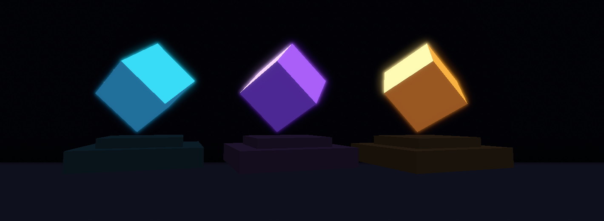
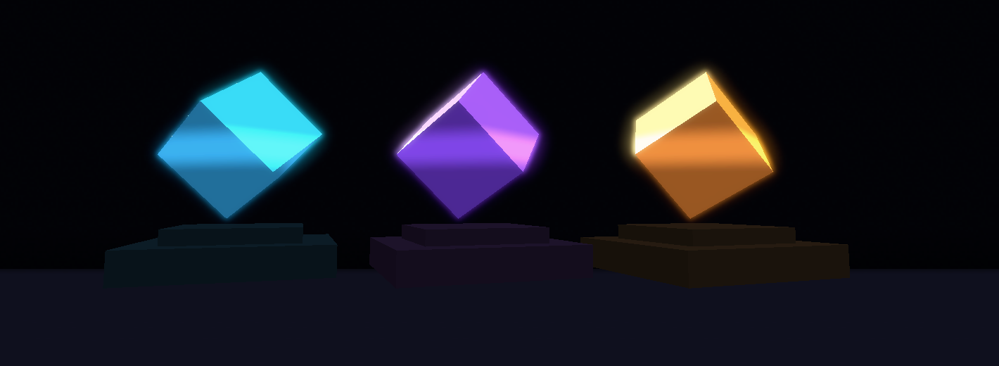

<div align="center">

# ✦ [星辉] Nightstar Bloom

**让光停留在你指定的切面，让流光沿你设计的方向。**


[下载版本](https://github.com/as3322909/NightStar-Bloom/releases) · [快速开始](#快速开始) · [模型制作](#制作自己的模型) · [命令](#命令与调节) · [AX 兼容](#arcartx-兼容)



<sub>自制晶体方块 · Minecraft 1.21.11 实机截图 · 未后期增强亮度或添加光效</sub>

</div>

Nightstar Bloom 是一个 Fabric 客户端模组，为模型中标记的部位绘制局部辉光，保留清晰核心、饱和窄光边和柔和外晕。普通材质不会一起变亮，不透明墙体会遮挡光源。

| 按模型设计 | 在游戏中呈现 |
| :--- | :--- |
| **分组发光** | BB 标记晶体、符文或装饰，只有选中的几何发光。 |
| **定向流光** | 两个空组确定起止点，亮带沿设定方向移动。 |
| **清晰层次** | 核心与外晕独立调节，支持静态、呼吸和流光。 |
| **AX 模型** | 支持世界 item_display 刚体及受支持的 idle 动画。 |

## 快速开始

测试环境：**Minecraft 1.21.11 · Java 21 · Fabric Loader 0.19.3 · Fabric API 0.141.4+1.21.11**。

1. 从 [最新 Release](https://github.com/as3322909/NightStar-Bloom/releases/latest) 下载 `Nightstar-Bloom-0.3.2.jar`，放入客户端 `mods/`，移除旧版 Bloom JAR。游戏内显示名为 `[星辉]Nightstar Bloom`。
2. 解压 `Nightstar-Bloom-Crystal-Examples-0.3.0.zip`，将其中 `resourcepacks/NightstarModelLab` 放入客户端 `resourcepacks/`，在游戏中启用。
3. 在**单独的创造测试世界**中，将示例的 `saves/ModelLab/datapacks/model_lab` 文件夹放入该世界的 `datapacks/`。
4. 进入世界执行：

```mcfunction
/reload
/function nightstar:setup
/nsbloom on
```

你会被传送到世界原点附近的晶体展台。示例会放置地板、背景和展示实体，并清理带 `nightstar_lab_model` 标签的旧展示，请在测试世界使用。数据包不会自动搭建场景。

**自己的 AX 模型不需要安装示例包或运行转换器。** 为 BB 组添加下述正式后缀，将模型放入 AX 的 `resourcepacks/ArcartX/resource/model/` 原有目录，执行 `/nsbloom reload`。模组在资源重载时生成网格、提取纹理并绑定 AX 模型 ID，无需手工导出清单。AX 仍负责普通模型加载及握手。原版 `item_model` 示例仍使用导出资源。Bloom 不提供动态方块光照。

```mcfunction
/nsbloom motion static
/nsbloom motion breath
/nsbloom motion flow
/nsbloom off
```

`/function nightstar:stress` 放置十二个晶体。原版路径展示静态几何；琥珀晶体的旋转／缩放 idle 动画只在 AX 路径播放。

## 制作自己的模型

### 标记发光组

在 Blockbench 组名末尾添加后缀，后代继承最近的已标记祖先；子组显式标记可覆盖父组。

| 后缀 | 效果 |
| :--- | :--- |
| `__bloom` | 完整晶体：核心、窄辉光、外晕。 |
| `__bloom_core` | 强调亮核心。 |
| `__bloom_rim` | 饱和窄辉光，不是几何描边。 |
| `__bloom_aura` | 柔和宽外晕。 |

```text
crystal_block
├── pedestal                 普通底座
└── crystal__bloom           发光晶体
    └── main_crystal
```

### 可选：指定流光方向

创建两个**空组**，通过原点位置确定方向：

```text
__flow_start  ───────────────→  __flow_end
    起点                           终点
```

也支持 `__flow_1` → `__flow_2`。必须成对且不重合。不需要流光时无需添加，保持默认 `motion static` 即可。

```mcfunction
/nsbloom motion flow
/nsbloom flowSpeed 0.55
```

主动选择 flow 但没有标记时，当前版本使用纹理 UV-V 方向。旋转骨骼上的流光方向需按具体模型验证。

<details>
<summary><b>查看流光实机截图</b></summary>



静态截图记录亮带的一帧，实际效果随时间沿标记方向移动。

</details>

### AX 自动加载与可选离线导出

AX 自动加载支持 BB 立方体、多层分组、内嵌 PNG、多纹理、UV 旋转及正式流光标记；外部 PNG 必须位于模型目录内并使用相对路径。组名仅使用本页列出的正式后缀。静态和动画模型都使用 AX 当次绘制的骨骼姿态，避免重复应用组变换或错误套用展示朝向；发光骨骼名需唯一。不支持的几何或损坏输入会报告来源，并保留上一套有效辉光资源。

可选标准资源包路径为 `assets/arcartx/model/<模型键>.bbmodel`，支持已启用目录包或 ZIP；它提供 Bloom 输入，模型本体仍需按 AX 自己的资源流程加载。不要在两条路径同时放置相同模型键。自动转换只在重载时运行，有文件、纹理、骨骼及内存预算；不在每帧扫描。

以下离线工具继续用于制作原版展示和示例包，AX 用户不需要运行：

转换器只需 Python 3.10+ 标准库。克隆源码，在项目根目录生成自制示例：

```powershell
python tools/make_crystals.py
```

输出为 `generated/crystals/`，BB 原文件为 `generated/crystal-source/`，示例 ZIP 为 `build/release/`；生成物不进入源码仓库。

转换自己的 BB 模型目录：

```powershell
$env:NSB_SAMPLES = 'C:\Models\MyCrystals'
$env:NSB_OUTPUT = 'C:\Models\BloomOutput'
$env:NSB_NAME_PREFIX = 'my_crystal_'
$env:NSB_AX_PREFIX = 'my_pack/'
python tools/export_gallery.py
```

纹理须内嵌为 PNG。支持立方体、层级旋转、多纹理和 UV 旋转；任意网格、Molang 表达式及 Bézier 动画不支持。无效输入会中止整批导出并保留旧输出。

清单位于资源包 `assets/nightstar_bloom/bloom/models.json`。静态导出用 v3，动画用 v4，运行时兼容 v1–v4。参见 [静态清单示例](manifest-v3-example.json)。

## 命令与调节

全部命令以 `/nsbloom` 开头，仅影响本地客户端。配置保存为 `config/nightstar_bloom.json`，默认 **crystal / static / medium**。参见 [配置示例](config-example.json)。

| 子命令 | 作用 |
| :--- | :--- |
| `on` · `off` | 开启／关闭。 |
| `strength <0..4>` | 总强度，默认 1；0 无发光贡献。 |
| `core <0..4>` | 核心亮度，默认 1.65。 |
| `halo <0..4>` | 辉光强度，默认 1。 |
| `radius <0..2>` | 扩散范围，默认 1；0 只保留核心。 |
| `color <r> <g> <b>` | RGB 乘色，每项 0..4，默认 1 1 1。 |
| `preset crystal\|soft\|restrained` | 晶体／柔和／克制风格。 |
| `quality low\|medium\|high` | 2／3／4 级处理。 |
| `motion static\|breath\|flow` | 静态／呼吸／流光。 |
| `flowSpeed <0..4>` | 流光速度，默认 0.55。 |
| `reload` | 重读配置和资源，返回加载结果。 |
| `status` | 版本、资源、AX 绑定、绘制和显存估算。 |
| `debug mask\|scene\|overlay\|off` | 遮罩／原场景／对齐叠加／正常显示。 |
| `diagnostics viewport <width> <height>` | 诊断开启时设置测试客户区尺寸并去除窗口边框，重启恢复；用于精确分辨率验收。 |
| `diagnostics on\|off` | 开发诊断，每次启动默认关闭。 |
| `profile <label> [seconds]` | 采集帧时间（默认 30 秒，支持 1..120 秒），保存在本地 logs 目录。 |

想保留切面、增强外围辉光，先调 `halo`；想扩大范围，再调 `radius`。使用 `core` 调本体亮度，避免把所有参数一起拉高。

## ArcartX 兼容

测试组合为 **AX 客户端 2.6.72／服务端 2.7.81**，覆盖世界中的 `item_display`，新增第三人称物品路径的臂甲静态与 idle 样本验证。Bloom 不替代 AX 的握手、资源加载或服务端配置。

将示例包 `resourcepacks/ArcartX/resource/model/nightstar_crystals/` 内的模型导入已有 AX 资源流程，完成握手和加载后，在测试世界执行 `/function nightstar:ax`。

自动加载会在内存中生成这些映射，不需要用户编辑清单。只有选择旧离线流程时才需配置：`space=ax`，刚体 `rig=rigid`，idle `rig=anim`，`aliases` 为 AX 资源键（也接受 `arcartx_geo:` 前缀）。

| 路径 | 行为 |
| :--- | :--- |
| 原版静态 item_display | 使用对应 item_model 网格。 |
| AX 刚体／受支持 idle 的 item_display | 使用同次实际绘制姿态生成辉光。 |
| AX 第三人称手持物品路径 | 自动 BB 网格读取实际骨骼姿态；臂甲静态与 idle 样本已验证。 |
| AX 未接管渲染 | 使用已有原版绑定，或不发光。 |
| AX 无对应绑定／不支持 | 保留本体，不添加错误辉光。 |
| GUI、第一人称、玩家／生物本体、时装 | 本版不提供独立辉光合成。 |
| 非 idle 动画 | 未验证，不作为本版兼容承诺。 |

0.3.2 延续同次绘制姿态同步，并修复静态模型在第三人称物品路径中错误使用 `fixed` 变换的问题。GUI 与第一人称不进入世界 Bloom 合成。适配入口只对已验证的 AX 2.6.72 二进制启用；版本或入口变化时暂停 AX 辉光，在 `status` 中提示，本体显示不受影响。AX 升级后需重新验证。

**修改 idle 后模型不动？** 当前 AX 版本可能在资源重载后保留旧动画状态。本次样本完整重启客户端后恢复播放，辉光正常跟随。可先重启排除缓存问题；Bloom 没有接管或修复 AX 动画缓存。

## 性能与限制

无可见光源时跳过合成，关闭时释放 GPU 目标。每帧上限为 2048 条网格和 262144 个蒙皮顶点，每个动画绑定最多 4096 个骨骼，姿态缓存随资源释放。更高分辨率、质量和独立动画实例会增加成本。

自动解析只在资源重载时进行，稳定运行保留一套已验证 CPU 资源供开关及重进使用；成功重载同时替换 CPU/GPU 代次，失败丢弃候选并保留旧资源。重载期间新旧数据会短暂共存。`autoCpuBytes` 是预算估算，不是 JVM 实际堆内存。单次自动资源预算 128 MiB，最多 4096 个 BB 文件；不支持 `.axmeta.json` 附加变换的输入会明确报错。

历史展示基线（2026-09-29，早期构建，非 0.3.2 性能保证）：i5-12400F / RTX 3070，实际 1920×1080 帧缓冲、medium、默认参数，各采集 10 秒真实渲染帧间隔；截图与采样分开进行。

| 场景 | 平均 FPS | 1% low FPS | 平均帧时间 | p99 帧时间 |
| :--- | ---: | ---: | ---: | ---: |
| 三晶体 · Bloom 开启 | 491.7 | 184.2 | 2.03 ms | 4.57 ms |
| 三晶体 · Bloom 关闭 | 809.1 | 243.2 | 1.24 ms | 3.27 ms |
| AX 两刚体 + 一 idle + 一原版回退 · 开启 | 578.3 | 263.1 | 1.73 ms | 3.48 ms |

这是本机短时观察，另有客户端并行运行；不同场景不能直接比较成本，也不作为跨硬件性能保证。本次第三人称修复已进行正常画面／遮罩截图检查，用户确认新增 idle 后模型与特效正常。对应开发候选在 854×480 下开关均约 30 FPS，受后台限帧影响，新增功能的独占开销无法判定；未执行完整压力矩阵或长期泄漏测试。

- 已测试 Iris 1.10.7 + Sodium 0.8.12：关闭光影、开启 Complementary Reimagined r5.8.1 时均可发光，后者已检查不透明墙遮挡；第三人称臂甲另验证了 Complementary Unbound r5.9.1 下的对齐。通过 Iris 公共 API 排除阴影绘制，在光影世界合成后添加 Bloom；不保证其他光影包、时间抗锯齿及自定义深度处理。`shader-pack-unverified` 表示启用光影时不作通用兼容保证，并非禁止运行。
- 自动 BB 的流光标记可被识别；复杂层级及第三人称骨骼下的流光方向尚未全面复核，当前臂甲验收使用 `motion static`。
- 不透明墙体可以遮挡光源；玻璃、水及第三方后处理不保证合成顺序。
- 屏幕空间辉光不会照亮周围方块。
- 无效清单保留上一套有效资源；检查 `status` 的错误后重新 `reload`。

<details>
<summary><b>开发与构建</b></summary>

使用 Java 21、Gradle 9.2.1，构建目标为 `build`；依赖固定于 `gradle.properties`。仓库不包含开发者客户端、服务端和缓存。

本开发工作区强制使用统一工具：

```powershell
& '.\构建工具\scripts\doctor.ps1' -Project nightstar-bloom
& '.\构建工具\scripts\build.ps1' -Project nightstar-bloom -Tasks build -Offline
```

构建会执行姿态生命周期回归。转换回归：`python tools/test_export.py`；仓库门禁回归：`python tools/test_public_audit.py`。

公开仓库只允许自制示例晶块。每次推送前运行 `python tools/public_audit.py preflight`，推送后依次运行 `remote-current`、`remote-history`、`remote-releases` 三轮检查；规则见 [AGENTS.md](AGENTS.md)。第三方测试模型和本地验收资料不进入仓库。

</details>

## 使用与分发

[自定义许可证](LICENSE)允许免费使用、修改和再分发；禁止模组收费、付费下载／解锁及收费整合包分发。商业服务器可以免费提供和使用。修改版须保留原作者信息并说明修改，不得冒充官方发布。

第三方部分遵守各自许可，见 [第三方说明](THIRD-PARTY-NOTICES.md)。这是源码可见许可，不是标准开源许可证。

---

<div align="center">

**原作者：阿肆 · [as3322909](https://github.com/as3322909)**<br>
原项目：[星辉]Nightstar Bloom

[获取最新版本 →](https://github.com/as3322909/NightStar-Bloom/releases)

</div>
